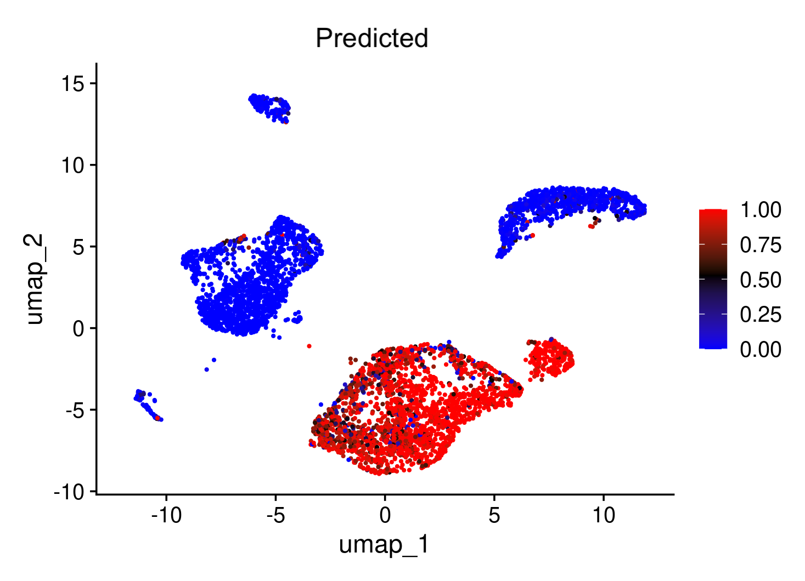
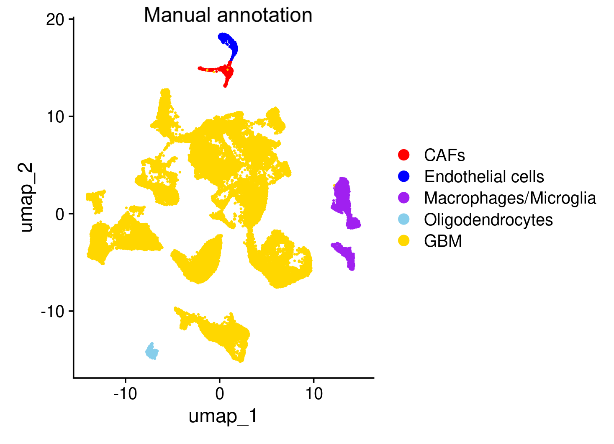
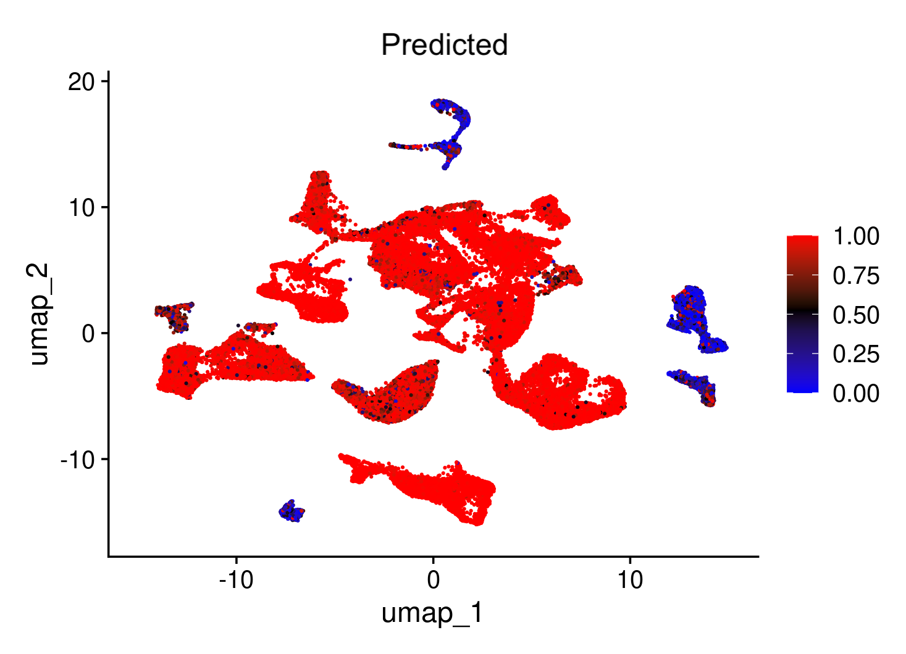

# Usage in R
### Gradient Boosting Model for Cell-Type Annotation in R

This repository provides a **gradient boosting–based prediction model** for identifying glioblastoma-associated cell populations in **single-cell RNA-seq** datasets using **R**.  
The model is designed for convenient use with **Seurat** workflows.

---

## Files

| File | Description |
|------|-------------|
| `model.R` | Predtreinde model, requires weights (`xgboots.model`). Contains the main function `predict_and_add_metadata` |
| `xgboots.model` | model weights |
| `chromosome_means_function.R` | calculates chromosome means per cell |
| `train_dataset_formation.R` | Training dataset preparation pipeline |
| `train_val_test.R` | Code for training, validation, and independent test evaluation |
| `gene_mapping.txt` | Contains gene-to-chromosome mapping derived from GTF annotation |
| `test_results_plots` | Folder with test inference results (.png) |


---

## Usage

The core function provided by this repository is:

```r
seurat_object <- predict_and_add_metadata(seurat_object, weights_path='xboost.model')
```

## Test Inference 
Test 1
<p align="center">  <br> <em>True labels for Test 1</em> </p> <p align="center">  <br> <em>Predicted labels for Test 1</em> </p>
Test 2
<p align="center">  <br> <em>True labels for Test 2</em> </p> <p align="center">  <br> <em>Predicted labels for Test 2</em> </p>
