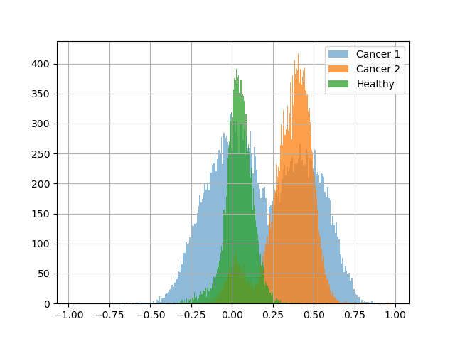

# Updates

## Datasets:
1. Cancer_1
```bash
wget -O GSE135045_RAW.tar 'https://www.ncbi.nlm.nih.gov/geo/download/?acc=GSE135045&format=file'
wget -O 3v3_10x/data.tar.gz https://cf.10xgenomics.com/samples/cell-exp/4.0.0/Parent_SC3v3_Human_Glioblastoma/Parent_SC3v3_Human_Glioblastoma_filtered_feature_bc_matrix.tar.gz
```
2. Cancer_2
```bash
wget -O GSE173278/features.tsv.gz \
  'https://www.ncbi.nlm.nih.gov/geo/download/?acc=GSE173278&format=file&file=GSE173278%5FscRNAseq%5Ffiltered%5Fcells%5Fgenes%2Etsv%2Egz'

wget -O GSE173278/barcodes.tsv.gz https://ftp.ncbi.nlm.nih.gov/geo/series/GSE173nnn/GSE173278/suppl/GSE173278%5FscRNAseq%5Ffiltered%5Fcells%5Fbarcodes%2Etsv%2Egz

wget -O GSE173278/matrix.mtx.gz https://ftp.ncbi.nlm.nih.gov/geo/series/GSE173nnn/GSE173278/suppl/GSE173278%5FscRNAseq%5Ffiltered%5Fcells%5Fnorm%5Fcounts%5Fmatrix%2Emtx%2Egz
```

3. Healthy reference
```bash
curl -L -o healthy/matrix.csv https://idk-etl-prod-download-bucket.s3.amazonaws.com/aibs_human_ctx_smart-seq/matrix.csv
```

Just to recap, we have 22 features for each observation. Hypothetically, all observations can be divided into two broad classes. I would also like to reiterate that, in the target class, we expect to see a shift in the distribution of values across these features, with the most pronounced changes being an increase in the expression of feature 7 and a decrease in feature 10.

After trying multiple approaches to obtain two distinct distributions using all 22 features, I concluded that we can restrict the analysis to features 7 and 10, as they appear to be the most robust predictors. From the perspective of the biological problem, these are also the features for which we would expect the strongest disruption in their distributions.

I therefore took features 7 and 10 and calculated the relative expression of each feature with respect to their sum. This effectively normalizes the data and reduces the batch effect, i.e., technical variation between samples. I then used a one-dimensional feature, Δ7–10, defined as the difference between the normalized expression of features 7 and 10.

For healthy cells (class 0), we would not expect a systematic difference between these two features. Therefore, the distribution of Δ7–10 for these observations should have a mean close to zero. In contrast, for cancer cells, the distribution should be shifted to the right for the reasons described above.

This feature consistently produces two distinct distributions and, importantly, appears to scale beyond a single experiment. When multiple experiments are combined, we observe a very similar overall pattern.

I also found samples from experiments involving normal, non-cancerous brain tissue collected post-mortem. When using Δ7–10 as the feature, these observations produce a single distribution with a mean close to zero, confirming our hypothesis. Thus, we now have a reference set of observations representing class 0.

In outputs, I uploaded three datasets with the Δ7–10 feature distribution already calculated:

1) cancer_1 - a combination of 8 brain cancer experiments: 7 from one experimental series and 1 from another. There are approximately 30,000 observations, with roughly equal proportions of classes 0 and 1.

2) cancer_2 - a combination of 10 brain cancer samples from the same sample series. There are approximately 70,000 observations, of which around 60,000 are cancer cells. Therefore, the distribution looks like a large class 1 peak and a much smaller class 0 peak.

3) healthy_reference - a reference set of healthy cells, with approximately 13,000 observations. It represents a single class 0 distribution. We can add more samples if needed.

healthy single nuclus datasets (We used 15k samples from smartseq dataset):
10x 76k nuclei: https://brain-map.org/our-research/cell-types-taxonomies/cell-types-database-rna-seq-data/human-m1-10x
smartseq 50k nuclei: https://brain-map.org/our-research/cell-types-taxonomies/cell-types-database-rna-seq-data/human-multiple-cortical-areas-smart-seq

